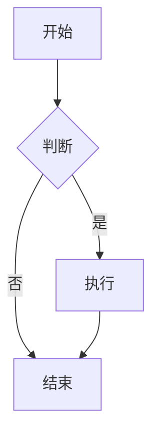
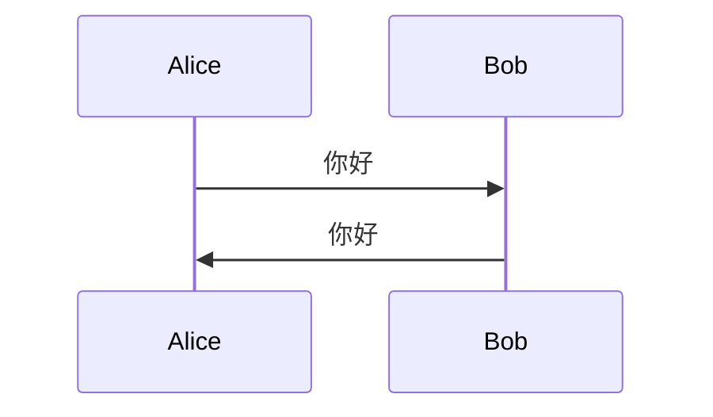

# 欣仔的技术小屋 - 完整使用指南

## 🎉 恭喜！博客已配置完成

你的博客已经成功搭建，包含以下所有高级功能：

### ✨ 已配置的功能

- ✅ **Redefine 主题** - 简洁现代的设计
- ✅ **LaTeX 数学公式** - 使用 MathJax 3.x，支持行内和块级公式
- ✅ **代码高亮** - Highlight.js，支持多种编程语言
- ✅ **Mermaid 图表** - 支持流程图、时序图等
- ✅ **本地搜索** - 快速搜索文章内容
- ✅ **RSS 订阅** - Atom 格式
- ✅ **字数统计** - 显示文章字数和阅读时间
- ✅ **中文字体优化** - Noto Sans SC
- ✅ **响应式设计** - 完美适配各种设备
- ✅ **明暗主题切换** - 支持自动切换
- ✅ **Font Awesome Pro** - 丰富的图标库
- ✅ **Pangu.js** - 自动为中英文之间添加空格
- ✅ **目录自动生成** - 文章目录自动编号
- ✅ **版权声明** - CC BY-NC-SA 4.0
- ✅ **图片懒加载** - 提升页面加载速度

## 📋 个人信息配置

已配置的个人信息：

- **站点名称**: 欣仔的技术小屋
- **作者**: 欣仔
- **邮箱**: zhouxinyu12138@gmail.com
- **GitHub**: https://github.com/neuqzxy
- **网站地址**: https://neuqzxy.github.io
- **语言**: 简体中文
- **时区**: 亚洲/上海

## 🚀 本地开发

### 启动开发服务器

```bash
# 方法 1: 使用 npm script
npm run server

# 方法 2: 直接使用 hexo 命令
npx hexo server

# 方法 3: 指定端口（如果默认端口被占用）
npx hexo server -p 8080
```

访问 http://localhost:4000 （或其他指定端口）查看博客。

### 清理缓存

```bash
npm run clean
# 或
npx hexo clean
```

### 生成静态文件

```bash
npm run build
# 或
npx hexo generate
```

## ✍️ 创建内容

### 创建新文章

```bash
npx hexo new post "文章标题"
```

文章会被创建在 `source/_posts/` 目录下。

### 文章 Front Matter 示例

```yaml
---
title: 我的第一篇文章
date: 2026-02-11 21:00:00
tags: 
  - 技术
  - 教程
categories:
  - 前端开发
---

文章摘要...

<!-- more -->

这里是文章正文...
```

### 创建新页面

```bash
npx hexo new page "页面名称"
```

## 📝 Markdown 高级功能

### 1. LaTeX 数学公式

#### 行内公式

```markdown
这是一个行内公式 $E = mc^2$
```

#### 块级公式

```markdown
$$
\int_{-\infty}^{\infty} e^{-x^2} dx = \sqrt{\pi}
$$
```

#### 矩阵

```markdown
$$
\begin{bmatrix}
a & b \\
c & d
\end{bmatrix}
$$
```

### 2. 代码高亮

````markdown
```python
def hello_world():
    print("Hello, World!")
```
````

支持的语言：Python, JavaScript, Java, C++, Go, Rust, TypeScript, PHP, Ruby 等。

### 3. Mermaid 图表

#### 流程图

````markdown

````

#### 时序图

````markdown

````

### 4. 引用和提示

```markdown
> 这是一个引用

> 💡 **提示**: 这是一个提示框
```

### 5. 任务列表

```markdown
- [x] 已完成的任务
- [ ] 未完成的任务
```

### 6. 表格

```markdown
| 列1 | 列2 | 列3 |
|-----|-----|-----|
| 内容1 | 内容2 | 内容3 |
```

## 🌐 部署到 GitHub Pages

### 前置准备

1. 在 GitHub 创建一个名为 `neuqzxy.github.io` 的仓库
2. 确保仓库是公开的（Public）

### 部署步骤

#### 方法 1: 使用部署脚本（推荐）

```bash
./deploy.sh
```

#### 方法 2: 手动部署

```bash
# 1. 清理缓存
npx hexo clean

# 2. 生成静态文件
npx hexo generate

# 3. 部署
npx hexo deploy
```

### 首次部署注意事项

首次部署时，Git 会要求输入 GitHub 用户名和密码。建议配置 SSH 密钥或使用 Personal Access Token。

### 配置 GitHub Actions 自动部署（可选）

创建 `.github/workflows/deploy.yml`：

```yaml
name: Deploy Hexo

on:
  push:
    branches: [ main ]

jobs:
  build:
    runs-on: ubuntu-latest
    steps:
      - uses: actions/checkout@v3
      
      - name: Setup Node.js
        uses: actions/setup-node@v3
        with:
          node-version: '18'
          
      - name: Install dependencies
        run: npm install
        
      - name: Build
        run: npm run build
        
      - name: Deploy
        uses: peaceiris/actions-gh-pages@v3
        with:
          github_token: ${{ secrets.GITHUB_TOKEN }}
          publish_dir: ./public
```

## 🎨 主题自定义

### 修改主题颜色

编辑 `_config.redefine.yml`：

```yaml
colors:
  primary: "#005CAF"  # 修改为你喜欢的颜色
```

### 修改首页横幅

```yaml
home_banner:
  title: 你的网站标题
  subtitle:
    text: ['副标题1', '副标题2', '副标题3']
```

### 修改社交链接

```yaml
home_banner:
  social_links:
    enable: true
    links:
      github: https://github.com/neuqzxy
      email: mailto:zhouxinyu12138@gmail.com
      # 可以添加更多社交链接
```

### 添加评论系统（可选）

编辑 `_config.redefine.yml`：

```yaml
comment:
  enable: true
  system: giscus  # 或 waline, gitalk, twikoo
  config:
    giscus:
      repo: 你的用户名/仓库名
      repo_id: 你的仓库ID
      category: Announcements
      category_id: 你的分类ID
```

## 📊 SEO 优化

### 1. 添加站点地图

```bash
npm install hexo-generator-sitemap --save
```

在 `_config.yml` 添加：

```yaml
sitemap:
  path: sitemap.xml
```

### 2. 添加百度站点地图

```bash
npm install hexo-generator-baidu-sitemap --save
```

在 `_config.yml` 添加：

```yaml
baidusitemap:
  path: baidusitemap.xml
```

## 🔧 常见问题

### Q: 端口被占用怎么办？

```bash
npx hexo server -p 8080  # 使用其他端口
```

### Q: 如何更新主题？

```bash
npm install hexo-theme-redefine@latest
```

### Q: 如何备份博客？

将整个项目文件夹（除了 `node_modules/` 和 `public/`）提交到 GitHub 仓库即可。

### Q: 数学公式不显示？

确保文章中使用了正确的语法：
- 行内公式：`$公式$`
- 块级公式：`$$公式$$`

### Q: Mermaid 图表不显示？

确保代码块使用了 `mermaid` 标识符：

````markdown

````

## 📚 参考资源

- [Hexo 官方文档](https://hexo.io/zh-cn/docs/)
- [Redefine 主题文档](https://redefine-docs.ohevan.com/zh/)
- [Markdown 语法指南](https://www.markdownguide.org/)
- [MathJax 文档](https://www.mathjax.org/)
- [Mermaid 文档](https://mermaid.js.org/)
- [Font Awesome 图标](https://fontawesome.com/icons)

## 💡 写作建议

1. **使用有意义的标题** - 让读者快速了解文章内容
2. **添加摘要** - 使用 `<!-- more -->` 分隔摘要和正文
3. **合理使用标签和分类** - 方便读者查找相关文章
4. **添加配图** - 图片放在 `source/images/` 目录下
5. **检查拼写和格式** - 使用 Markdown 预览工具
6. **定期备份** - 将源文件提交到 Git 仓库

## 📧 获取帮助

如有问题，可以通过以下方式获取帮助：

- 查阅 [Hexo 文档](https://hexo.io/zh-cn/docs/)
- 查阅 [Redefine 主题文档](https://redefine-docs.ohevan.com/zh/)
- 在 [GitHub Issues](https://github.com/EvanNotFound/hexo-theme-redefine/issues) 提问

## 🎊 开始写作吧！

你的博客已经准备好了，现在就开始创作你的第一篇文章吧！

```bash
npx hexo new post "我的第一篇博客"
```

祝你写作愉快！🎉
