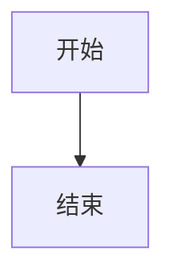

# 欣仔的技术小屋

这是基于 Hexo + Redefine 主题搭建的个人技术博客。

## 📦 已安装的功能

- ✅ Hexo 8.0.0
- ✅ Redefine 主题（最新版）
- ✅ LaTeX 数学公式支持 (MathJax)
- ✅ 代码高亮 (Highlight.js)
- ✅ Mermaid 图表支持
- ✅ 本地搜索功能
- ✅ RSS 订阅
- ✅ 字数统计
- ✅ 中文字体优化
- ✅ 响应式设计
- ✅ 明暗主题切换

## 🚀 快速开始

### 本地预览

```bash
# 清理缓存
npm run clean

# 启动本地服务器
npm run server
```

访问 http://localhost:4000 查看博客。

### 构建部署

```bash
# 生成静态文件
npm run build
```

生成的文件在 `public/` 目录下。

## 📝 写作

### 创建新文章

```bash
npx hexo new post "文章标题"
```

### 创建新页面

```bash
npx hexo new page "页面名称"
```

### 文章 Front Matter 示例

```yaml
---
title: 文章标题
date: 2026-02-11 21:00:00
tags: 
  - 标签1
  - 标签2
categories:
  - 分类名
---
```

## ✨ 功能说明

### LaTeX 数学公式

支持行内公式和块级公式：

- 行内公式: `$E = mc^2$`
- 块级公式: `$$\int_{a}^{b} f(x)dx$$`

### 代码高亮

支持多种编程语言的代码高亮，只需在代码块中指定语言：

````markdown
```python
print("Hello, World!")
```
````

### Mermaid 图表

支持流程图、时序图等：

````markdown

````

## 📁 目录结构

```
.
├── _config.yml              # Hexo 配置文件
├── _config.redefine.yml     # Redefine 主题配置
├── package.json             # 依赖配置
├── source/                  # 源文件目录
│   ├── _posts/             # 文章目录
│   ├── about/              # 关于页面
│   ├── categories/         # 分类页面
│   └── tags/               # 标签页面
└── themes/                  # 主题目录
```

## ⚙️ 配置说明

### 个人信息配置

在 `_config.yml` 中修改：

```yaml
title: 欣仔的技术小屋
author: 欣仔
url: https://neuqzxy.github.io
```

在 `_config.redefine.yml` 中修改：

```yaml
info:
  title: 欣仔的技术小屋
  author: 欣仔
  url: https://neuqzxy.github.io

home_banner:
  social_links:
    links:
      github: https://github.com/neuqzxy
      email: mailto:zhouxinyu12138@gmail.com
```

### 主题颜色

在 `_config.redefine.yml` 中修改：

```yaml
colors:
  primary: "#005CAF"  # 主色调
```

## 📚 参考资料

- [Hexo 官方文档](https://hexo.io/zh-cn/docs/)
- [Redefine 主题文档](https://redefine-docs.ohevan.com/)
- [Markdown 语法指南](https://www.markdownguide.org/)

## 📧 联系方式

- **Email**: zhouxinyu12138@gmail.com
- **GitHub**: [@neuqzxy](https://github.com/neuqzxy)

## 📄 许可证

本项目遵循 MIT 许可证。
