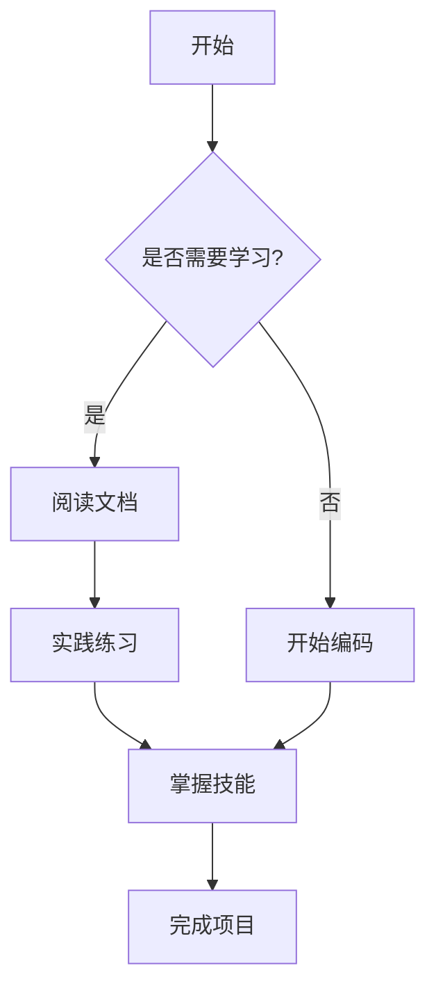
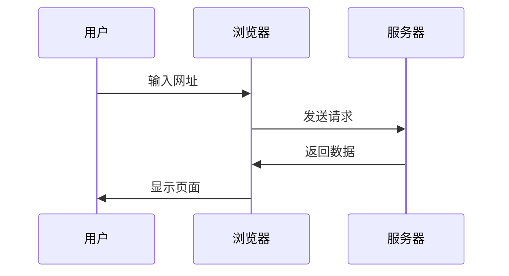

## 🎉 欢迎

欢迎来到**欣仔的技术小屋**！这是我的第一篇博客文章。本站使用 Hexo + Redefine 主题搭建，支持各种强大的功能。

<!-- more -->

## ✨ 功能展示

### 代码高亮

主题支持多种编程语言的代码高亮：

```python
def fibonacci(n):
    """计算斐波那契数列"""
    if n <= 1:
        return n
    return fibonacci(n-1) + fibonacci(n-2)

# 测试
for i in range(10):
    print(f"F({i}) = {fibonacci(i)}")
```

```javascript
// JavaScript 示例
const greet = (name) => {
  console.log(`Hello, ${name}!`);
};

greet('World');
```

```java
// Java 示例
public class HelloWorld {
    public static void main(String[] args) {
        System.out.println("Hello, World!");
    }
}
```

### 数学公式 (LaTeX)

主题支持 LaTeX 数学公式渲染：

**行内公式**: 这是一个行内公式 $E = mc^2$，爱因斯坦的质能方程。

**块级公式**:

$$
\int_{-\infty}^{\infty} e^{-x^2} dx = \sqrt{\pi}
$$

**矩阵**:

$$
\begin{bmatrix}
a & b \\
c & d
\end{bmatrix}
\begin{bmatrix}
x \\
y
\end{bmatrix}
=
\begin{bmatrix}
ax + by \\
cx + dy
\end{bmatrix}
$$

**求和公式**:

$$
\sum_{i=1}^{n} i = \frac{n(n+1)}{2}
$$

### Mermaid 图表

主题支持 Mermaid 图表：



**流程图示例**:



### 引用块

> 学习如逆水行舟，不进则退。  
> —— 古语

> 💡 **提示**: 这个博客会持续更新技术文章，记录我的学习和成长历程。

### 列表

**无序列表**:
- 前端开发
  - HTML/CSS
  - JavaScript
  - React/Vue
- 后端开发
  - Python
  - Node.js
  - 数据库
- DevOps
  - Docker
  - CI/CD
  - 云服务

**有序列表**:
1. 学习基础知识
2. 动手实践
3. 总结归纳
4. 分享交流

### 表格

| 语言       | 类型     | 难度   | 推荐指数 |
|----------|--------|------|------|
| Python   | 解释型  | ⭐⭐   | ⭐⭐⭐⭐⭐ |
| JavaScript | 解释型 | ⭐⭐⭐ | ⭐⭐⭐⭐⭐ |
| Java     | 编译型  | ⭐⭐⭐⭐ | ⭐⭐⭐⭐ |
| C++      | 编译型  | ⭐⭐⭐⭐⭐ | ⭐⭐⭐⭐ |

### 任务列表

- [x] 搭建博客
- [x] 配置主题
- [x] 编写第一篇文章
- [ ] 添加更多内容
- [ ] 优化 SEO
- [ ] 添加评论系统

## 📝 关于本站

本站特色：

1. **简洁美观**: 采用 Redefine 主题，界面简洁现代
2. **功能强大**: 支持 LaTeX、代码高亮、图表等
3. **响应式设计**: 完美适配手机、平板、电脑
4. **黑暗模式**: 支持明暗主题切换
5. **搜索功能**: 快速找到想要的内容

## 🔗 链接

- [GitHub](https://github.com/neuqzxy)
- [Email](mailto:zhouxinyu12138@gmail.com)

## 📢 结语

感谢你访问我的博客！如果你有任何问题或建议，欢迎通过邮件或 GitHub 与我联系。

让我们一起在技术的道路上不断前行！💪
